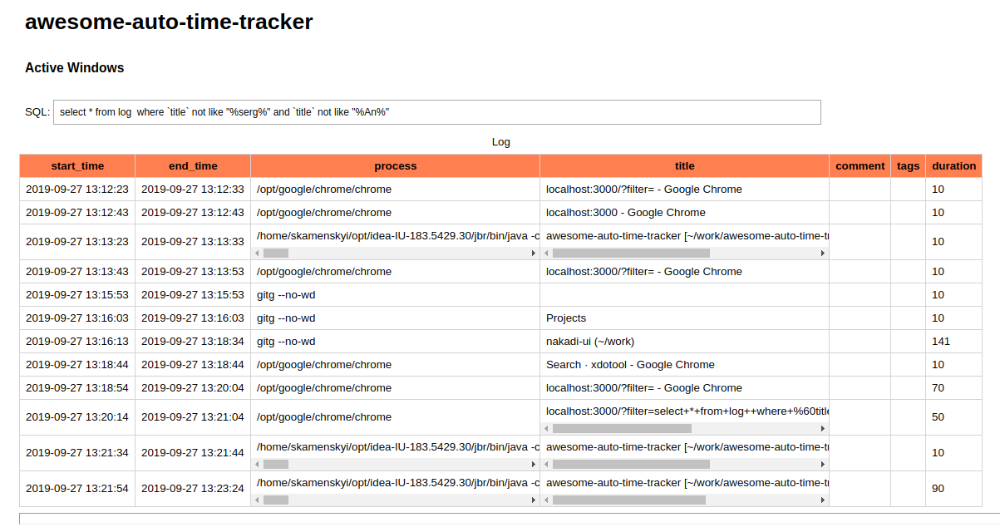

# awesome-auto-time-tracker

Awesome automatic time tracker for Linux. 



It is a local NodeJS web server.

It uses  [xdotool](https://github.com/jordansissel/xdotool) on Linux 
(but also could be adopted to [windows](https://github.com/ebranlard/xdotool-for-windows) 
and [mac os](https://github.com/twof/osxdotool))
to collect  the history and the duration of currently active window on a desktop.

The NodeJS process calls `xdotool` periodically and  stores collected statistics to a SQLite DB.
It also provide Web based UI (and API in the future) for an analise. 


## Usage

### Install

Install `xdotool`

```sh
sudo apt install xdotool
```

Install NodeJS dependency (tested on NodeJS 12)

```sh
npm install
```

Start server

```sh
npm start
```

Open http://localhost:3000
